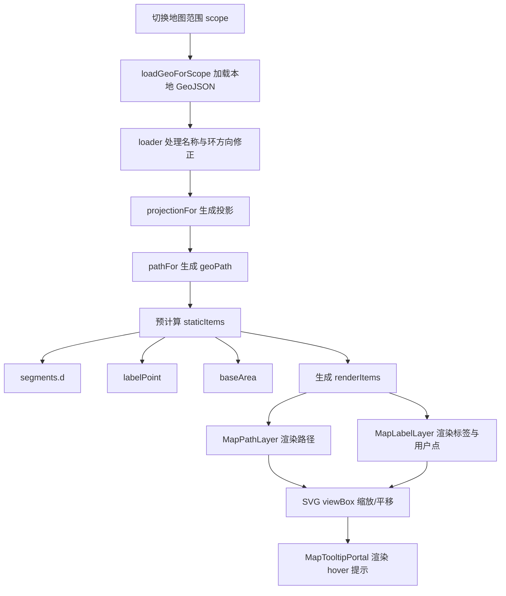
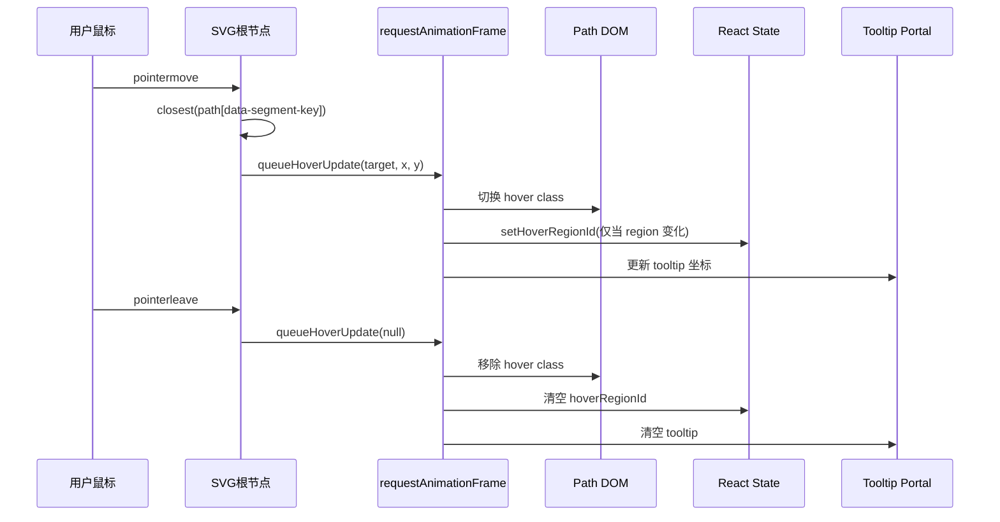

# 地图绘制与 Hover 性能优化文档

本文档总结当前项目中地图模块的实现方式，以及 hover 性能优化的演进过程，便于后续维护和继续优化。

## 1. 目标

地图模块需要同时满足下面几类需求：

- 支持国内与世界两套地图切换
- 支持点击地区后打开录入弹窗
- 支持 hover 查看地区信息
- 支持缩放、平移
- 在世界地图上兼顾大国常驻标签与小国 hover 标签
- 在大屏场景下尽量降低 hover 滑动时的卡顿感

## 2. 数据来源与预处理

### 2.1 国内地图

- 数据文件：`public/maps/china-provinces.json`
- 加载入口：[loader.ts](file:///Users/bytedance/project/personal_travel_daily/src/geo/loader.ts)
- 处理逻辑：
  - 过滤 `南海诸岛`
  - 统一省级名称，去掉 `省 / 市 / 自治区 / 特别行政区` 等后缀
  - 对 GeoJSON 的环方向做修正，避免 `d3-geo` 将多边形误判为“超过半个地球”的反向面

### 2.2 世界地图

- 数据文件：`public/maps/world-countries.json`
- 加载入口：[loader.ts](file:///Users/bytedance/project/personal_travel_daily/src/geo/loader.ts)
- 处理逻辑：
  - 逐个国家检查球面面积
  - 若 `geoArea(feature) > 2 * Math.PI`，认为该国家环方向异常
  - 自动反转其 `Polygon / MultiPolygon` 环方向

### 2.3 缓存策略

- 国内、世界地图在加载后都会缓存在内存中
- 相同 `scope` 下不会重复请求或重复解析
- 当前缓存位于：
  - `chinaCache`
  - `worldCache`

## 3. 投影与路径生成

### 3.1 投影选择

- 国内地图：`geoMercator`
- 世界地图：`geoNaturalEarth1`
- 实现位置：[projection.ts](file:///Users/bytedance/project/personal_travel_daily/src/geo/projection.ts)

### 3.2 自适应 fitExtent

地图并不是固定缩放，而是基于 SVG 逻辑尺寸进行自适应投影：

- 国内：`fitExtent([[16, 16], [width - 16, height - 16]])`
- 世界：`fitExtent([[10, 10], [width - 10, height - 10]])`

这样可以让同一套 GeoJSON 在统一画布尺寸中稳定落位。

### 3.3 路径生成

- 使用 `geoPath(projection)` 生成 SVG `path d`
- 实际封装在 [projection.ts](file:///Users/bytedance/project/personal_travel_daily/src/geo/projection.ts) 的 `pathFor()`

## 4. 地图渲染结构

主组件位于：[TravelMap.tsx](file:///Users/bytedance/project/personal_travel_daily/src/components/TravelMap.tsx)

当前渲染层分为三部分，外加一层品牌化头部控件区：

### 4.0 地图渲染流程图



### 4.1 路径层 `MapPathLayer`

- 职责：只负责地区边界路径渲染
- 特点：
  - 已拆成 `memo` 子组件
  - 运行时直接读取预计算好的 `d`
  - 不再在 hover 时通过 React state 重算每个 path 的 class

### 4.2 标签层 `MapLabelLayer`

- 职责：负责国家/省份名称和用户标记点
- 特点：
  - 已拆成 `memo` 子组件
  - 分成两类数据：
    - `largeLabelItems`：大区域常驻标签
    - `hoverLabelItem`：小区域 hover 时单独显示

### 4.3 提示层 `MapTooltipPortal`

- 职责：hover 时显示地区名与记录数
- 特点：
  - 使用 `createPortal()` 渲染到 `document.body`
  - 避免被地图容器的 `overflow`、层级或其他模块遮挡

### 4.4 地图头部控件区

- 位置：地图模块标题区
- 当前结构：
  - 左侧：模块标题、图标徽章、地图说明
  - 右侧：`segmented header`
- `segmented header` 内包含：
  - 地图说明胶囊
  - 国内 / 世界视图切换按钮
- 画布右上角仅保留缩放 / 重置按钮，职责更清晰

## 5. 缩放与平移

### 5.1 实现方式

当前不是通过 CSS transform 缩放地图，而是直接修改 SVG 的 `viewBox`：

- `viewBox = { x, y, w, h }`
- 鼠标滚轮、按钮点击会改变 `w/h`
- 拖拽平移会改变 `x/y`

### 5.2 优点

- 点击区域与视觉区域始终一致
- 不会出现 CSS 缩放后路径命中区域错位的问题
- 标签和用户点可以基于当前缩放做反向缩放控制

### 5.3 关键状态

- `viewBox`
- `viewBoxRef`
- `dragRef`

### 5.4 品牌化地图控件

地图模块当前除了交互功能，也有一套统一的品牌控件语言：

- 视图切换：`MapToggle`
  - 使用滑块式 segmented 切换
  - 带 `compass / globe` 图标
- 缩放按钮：`map-zoom-button`
  - 使用统一的玻璃感品牌控件样式
  - 保持与首页 Hero、统计卡、地图头部一致的视觉语言

## 6. 标签显示策略

### 6.1 为什么不能全部常驻显示

世界地图中大量小国、岛屿国家非常密集，如果全部常驻显示名称，会出现：

- 标签严重重叠
- hover 信息被遮挡
- 文本绘制成本明显升高

### 6.2 当前策略

对每个地区先预计算：

- `labelPoint`
- `baseArea`

运行时根据当前缩放比例计算：

- `projectedArea = baseArea * currentScale^2`

然后按阈值决定标签是否显示：

- 大国：超过阈值则常驻显示
- 小国：默认不显示，仅在 hover 时显示
- 选中区域：无论大小都显示

### 6.3 标签位置策略

`centroid` 对于法国、印尼、狭长国家、多岛国家不稳定，因此当前不是直接使用质心，而是：

1. 取 `path.centroid()`
2. 取 `bounds` 内多组候选点
3. 用 `geoContains()` 判断点是否真正落在该地区内部
4. 选择距离质心最近的内部点作为标签点

这样可以减少标签落在边界外的问题。

## 7. Hover 性能优化演进

### 7.1 初始方案

最初 hover 逻辑直接挂在每个 `path` 上的 React 事件：

- `onMouseEnter`
- `onMouseMove`
- `onMouseLeave`

问题：

- 每个路径都绑定 React 事件
- `mousemove` 频繁触发 `setState`
- tooltip 坐标和 hover 状态分开更新
- 大量国家路径时，滑动 hover 容易卡顿

### 7.2 第一轮优化

做过这些优化：

- tooltip 坐标更新改成 `requestAnimationFrame`
- 路径层与标签层拆成 `memo`
- 小国 hover 标签单独渲染

改善了高频 setState，但仍然存在：

- Path 层仍参与 hover 时的 React diff
- hover 高亮仍然依赖 React 状态
- 事件依然挂在大量 path 节点上

### 7.3 当前方案：原生事件代理 + DOM 高亮

现在 hover 已切换到地图根层的原生事件代理：

- 监听位置：SVG 根节点
- 监听事件：
  - `pointermove`
  - `pointerleave`

处理流程：

1. 在根层 `pointermove` 中通过 `event.target.closest('path[data-segment-key]')` 找到命中的 path
2. 将当前命中的 path 缓存在 `pendingHoverRef`
3. 用 `requestAnimationFrame` 合批到同一帧执行
4. 在同一帧中完成：
   - 切换 hover path 的 DOM class
   - 更新 hover region
   - 更新 tooltip 坐标

### 7.3.1 Hover 事件代理时序图



### 7.4 为什么这样更快

核心收益有三点：

- 不再给每个 path 注册 React hover 事件
- Path 高亮直接切换 DOM class，不再触发 Path 层整体重渲染
- hover 状态与 tooltip 更新合并到同一帧中

## 8. 当前性能优化点清单

当前已经落地的优化如下：

### 8.1 渲染静态化

在 `path` 存在后，对每个地区一次性预计算：

- `segments[].d`
- `labelPoint`
- `baseArea`

这些结果保存在 `staticItems` 中，只在以下场景重算：

- `scope` 变化
- 地图数据变化
- 投影变化

### 8.2 动态状态最小化

hover 时真正依赖 React 状态的只有：

- `hoverRegionId`
- `tooltipPos`

而路径高亮本身已经不通过 React state 驱动。

### 8.3 标签层拆分

- `largeLabelItems`
- `hoverLabelItem`

hover 小国时不会让整层大国标签一起重建。

### 8.4 Tooltip Portal

- hover tooltip 不再受地图容器裁剪
- 层级更稳定
- 避免局部布局影响 tooltip 绘制

### 8.5 头部控件与画布职责拆分

在当前产品形态中，把地图说明与视图切换从画布内部移到了标题区：

- 避免控件压在地图内容之上
- 提升地图区域可视面积
- 降低地图内悬浮控件与 hover / 缩放操作的视觉冲突

## 9. 点击与拖拽的关系

地图同时支持：

- hover
- click 选区
- drag 平移

为避免拖拽误触点击，当前判断逻辑为：

- `pointerdown` 开始记录拖拽
- `pointermove` 超过阈值认为是拖拽
- `pointerup` 时，只有“未拖拽且存在 hoverRegion”才触发 `onSelectRegion`

这样可以避免平移地图时误打开录入弹窗。

## 10. 测试覆盖

当前与地图相关的测试位于：

- [TravelMap.spec.tsx](file:///Users/bytedance/project/personal_travel_daily/src/components/__tests__/TravelMap.spec.tsx)

已覆盖：

- 大国标签默认显示
- 小国放大到阈值后显示
- hover 后点击区域触发选择

测试命令：

```bash
npm run test
```

## 11. 已知权衡

### 11.1 React 状态仍存在少量更新

虽然 hover 高亮已不依赖 React 渲染，但下面两项仍然通过 React state 更新：

- `hoverRegionId`
- `tooltipPos`

这意味着极端高频滑动时，仍会有轻微更新开销。

### 11.2 labelPoint 仍在组件层预计算

目前 `labelPoint` / `baseArea` / `segments.d` 预计算在 `TravelMap` 内部完成，而不是下沉到加载层。

优点：

- 逻辑集中在地图组件

代价：

- scope 变化时仍会在组件层做一轮计算

## 12. 后续可继续优化的方向

### 12.1 下沉预计算到 `loader`

可以把下面这些计算结果直接在加载阶段或 scope 初始化阶段缓存：

- `segments`
- `labelPoint`
- `baseArea`

这样 `TravelMap` 更接近纯渲染层。

### 12.2 常驻标签继续分块

如果后续国家数量或标签逻辑继续变复杂，可以把 `largeLabelItems` 再按区域分片 memo。

### 12.3 Tooltip 进一步去状态化

理论上可以把 tooltip 改成更接近 DOM imperative 更新：

- hover 区域变化时才触发 React state
- 坐标变化走 DOM style 直接更新

不过目前收益相对有限，建议在实际 profiling 后再决定。

## 13. 相关文件索引

- 地图主组件：
  - [TravelMap.tsx](file:///Users/bytedance/project/personal_travel_daily/src/components/TravelMap.tsx)
- 地图视图切换：
  - [MapToggle.tsx](file:///Users/bytedance/project/personal_travel_daily/src/components/MapToggle.tsx)
- 图标系统：
  - [TravelIcon.tsx](file:///Users/bytedance/project/personal_travel_daily/src/components/TravelIcon.tsx)
- 地图数据加载：
  - [loader.ts](file:///Users/bytedance/project/personal_travel_daily/src/geo/loader.ts)
- 投影与路径：
  - [projection.ts](file:///Users/bytedance/project/personal_travel_daily/src/geo/projection.ts)
- 样式：
  - [index.css](file:///Users/bytedance/project/personal_travel_daily/src/styles/index.css)
- 测试：
  - [TravelMap.spec.tsx](file:///Users/bytedance/project/personal_travel_daily/src/components/__tests__/TravelMap.spec.tsx)
