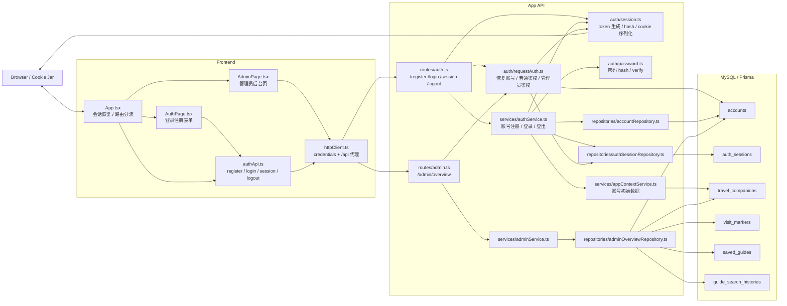
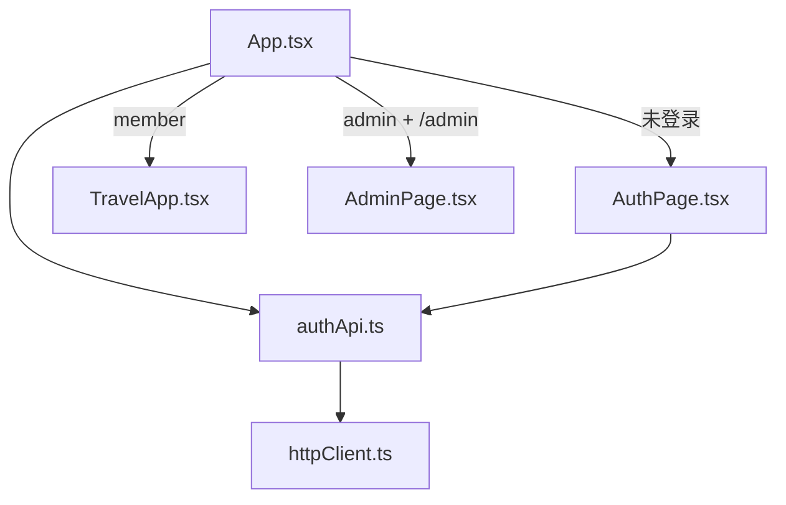
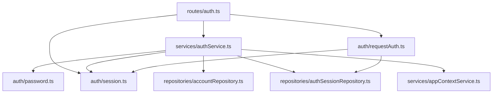
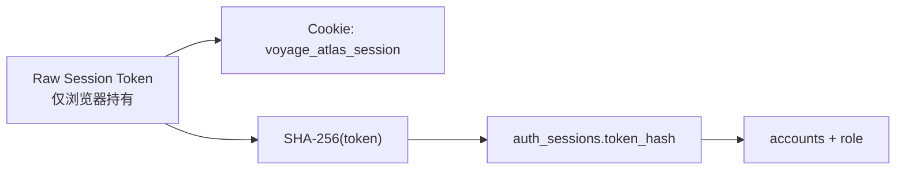
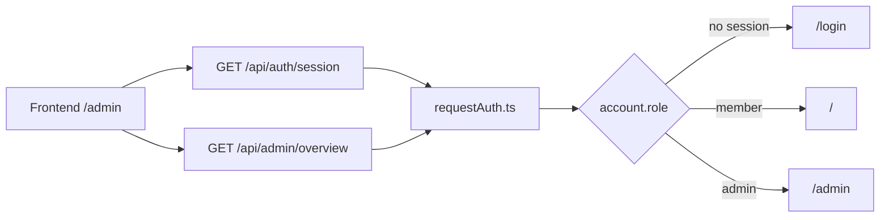

# 认证模块架构图

本文档用于评审“认证模块整体结构”，重点回答下面几个问题：

- 前端认证相关模块分别负责什么
- 后端路由、服务、会话、仓储如何分层
- 会话 token、Cookie、数据库 session 之间如何流转
- 管理员权限判断落在哪一层

若需要配合阅读，请同时参考：

- [登录注册与会话管理时序图](file:///Users/bytedance/project/personal_travel_daily/docs/technical/auth-sequence-diagrams.md)
- [登录注册 + 会话 + 管理员权限技术方案](file:///Users/bytedance/project/personal_travel_daily/docs/technical/auth-technical-design.md)

## 1. 认证模块总览

### 评审重点

- 前端不直接管理 session token 逻辑，而是通过 `authApi + httpClient` 与后端交互
- 后端把认证职责拆成：
  - 路由层
  - 服务层
  - 会话工具层
  - 鉴权恢复层
  - 仓储层
- 管理员权限不在前端判断真值，而在 `requestAuth.ts`

## 2. 前端认证模块分层

### 前端职责划分

- [App](file:///Users/bytedance/project/personal_travel_daily/src/modules/App.tsx)
  - 首次启动时调用 `fetchSession()`
  - 根据会话结果决定显示登录页、主应用或后台页
  - 处理 `/login`、`/register`、`/admin` 的分流
- [AuthPage](file:///Users/bytedance/project/personal_travel_daily/src/modules/auth/AuthPage.tsx)
  - 承担表单交互，不负责 session 存储
- [authApi](file:///Users/bytedance/project/personal_travel_daily/src/lib/api/authApi.ts)
  - 封装 register / login / session / logout 调用
- [httpClient](file:///Users/bytedance/project/personal_travel_daily/src/lib/api/httpClient.ts)
  - 负责请求基础能力
  - 默认携带 `credentials`
  - 本地优先走同源代理

## 3. 后端认证模块分层

### 后端职责划分

- [routes/auth.ts](file:///Users/bytedance/project/personal_travel_daily/server/appApi/routes/auth.ts)
  - 入参校验
  - 调用 service
  - 统一写 `Set-Cookie`
- [services/authService.ts](file:///Users/bytedance/project/personal_travel_daily/server/appApi/services/authService.ts)
  - 注册账号
  - 登录校验
  - 创建 session
  - 删除 session
- [auth/session.ts](file:///Users/bytedance/project/personal_travel_daily/server/appApi/auth/session.ts)
  - 生成随机 token
  - hash token
  - 计算过期时间
  - 序列化 cookie
- [auth/requestAuth.ts](file:///Users/bytedance/project/personal_travel_daily/server/appApi/auth/requestAuth.ts)
  - 从请求中恢复当前账号
  - `requireAuthenticatedAccount()`
  - `requireAdminAccount()`

## 4. Session 存储与恢复结构

### 关键原则

- 浏览器持有原始 token
- 数据库存的是 `token_hash`
- 服务端恢复登录时：
  - 读取 cookie
  - hash
  - 查 `auth_sessions`
  - 拿到关联的 `Account`

## 5. 管理员权限落点

### 权限设计结论

- 前端可以根据 `session` 结果优化体验
- 但后台接口最终必须由后端按 `role` 做裁决
- 也就是说：
  - 前端负责“怎么跳”
  - 后端负责“能不能进”

## 6. 关键源码锚点

- 前端入口：
  - [App.tsx](file:///Users/bytedance/project/personal_travel_daily/src/modules/App.tsx)
  - [AuthPage.tsx](file:///Users/bytedance/project/personal_travel_daily/src/modules/auth/AuthPage.tsx)
- 前端 API：
  - [authApi.ts](file:///Users/bytedance/project/personal_travel_daily/src/lib/api/authApi.ts)
  - [httpClient.ts](file:///Users/bytedance/project/personal_travel_daily/src/lib/api/httpClient.ts)
- 后端路由：
  - [auth.ts](file:///Users/bytedance/project/personal_travel_daily/server/appApi/routes/auth.ts)
  - [admin.ts](file:///Users/bytedance/project/personal_travel_daily/server/appApi/routes/admin.ts)
- 后端实现：
  - [authService.ts](file:///Users/bytedance/project/personal_travel_daily/server/appApi/services/authService.ts)
  - [requestAuth.ts](file:///Users/bytedance/project/personal_travel_daily/server/appApi/auth/requestAuth.ts)
  - [session.ts](file:///Users/bytedance/project/personal_travel_daily/server/appApi/auth/session.ts)
  - [authSessionRepository.ts](file:///Users/bytedance/project/personal_travel_daily/server/appApi/repositories/authSessionRepository.ts)
- 数据模型：
  - [schema.prisma](file:///Users/bytedance/project/personal_travel_daily/server/prisma/schema.prisma)

## 7. 评审建议

建议在评审会上按下面顺序讲：

1. 先看“认证模块总览”
2. 再讲“前端分层”和“后端分层”
3. 然后讲“Session 存储与恢复结构”
4. 最后讲“管理员权限落点”

这样可以先讲“模块边界”，再讲“关键安全与权限决策”。
