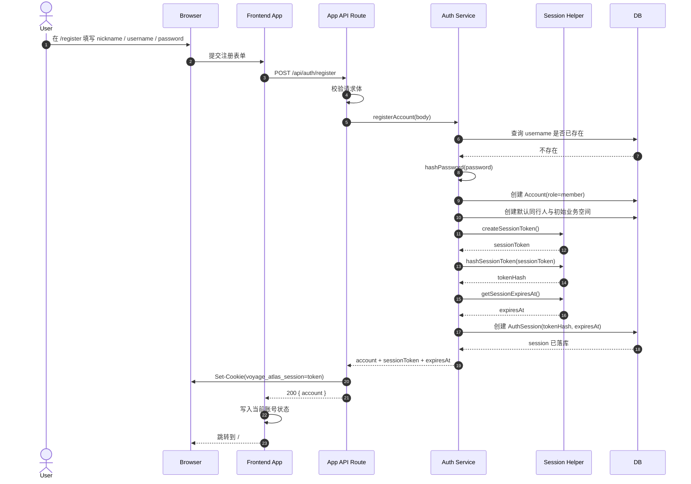
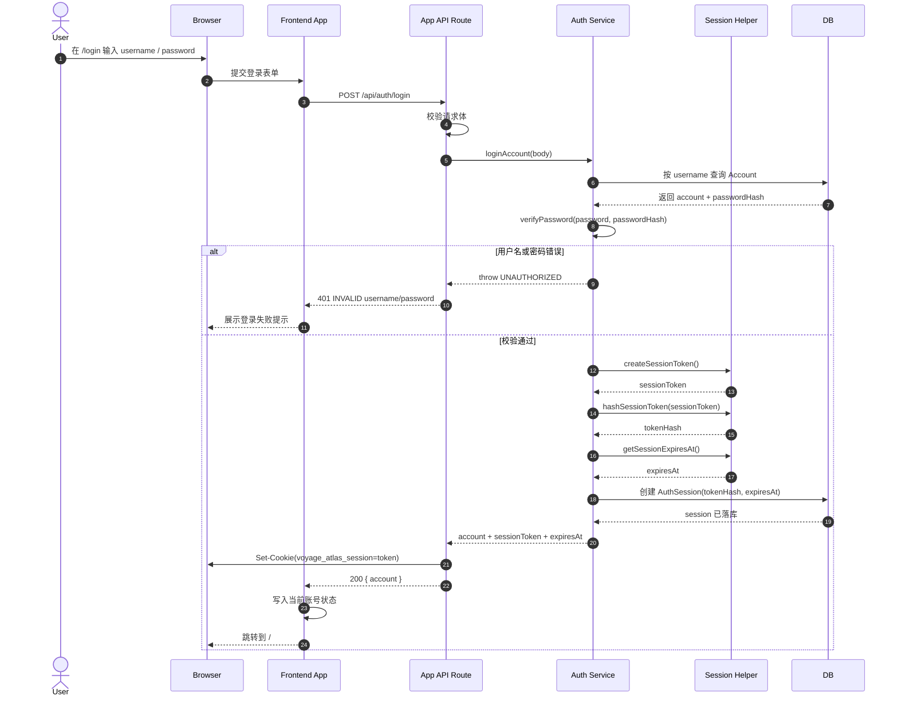
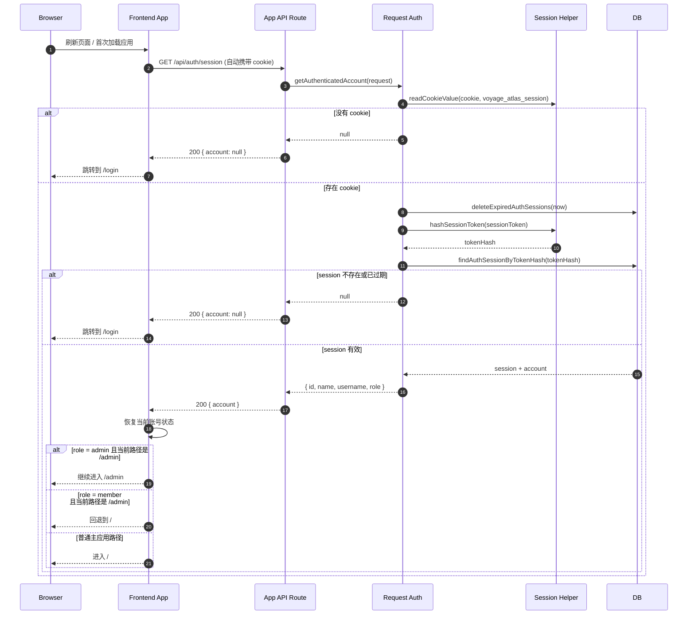
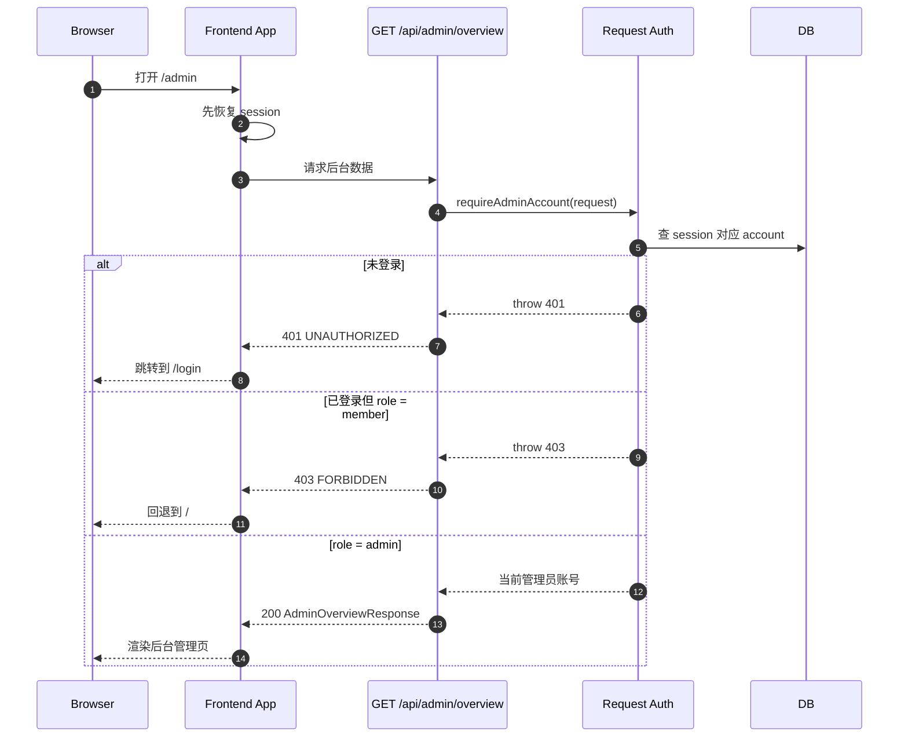

# 登录注册与会话管理时序图

本文档用于评审场景，聚焦“登录注册 + 会话管理”的关键时序，不展开所有实现细节。若需要查看完整技术设计，请同时阅读：

- [认证模块架构图](file:///Users/bytedance/project/personal_travel_daily/docs/technical/auth-architecture-diagram.md)
- [登录注册 + 会话 + 管理员权限技术方案](file:///Users/bytedance/project/personal_travel_daily/docs/technical/auth-technical-design.md)
- [登录注册说明](file:///Users/bytedance/project/personal_travel_daily/docs/technical/auth-login-register.md)

## 参与方

- `Browser`：浏览器与用户交互界面
- `Frontend App`：前端 React 应用
- `App API Route`：`server/appApi/routes/auth.ts`
- `Auth Service`：`server/appApi/services/authService.ts`
- `Session Helper`：`server/appApi/auth/session.ts`
- `DB`：MySQL + Prisma（`accounts` / `auth_sessions`）

## 1. 注册并自动登录

适用场景：

- 用户首次在 `/register` 提交昵称、用户名、密码
- 注册成功后无需再手动登录，直接进入已登录态



评审重点：

- 注册与 session 创建在同一条成功主链路上
- 数据库存储的是 `tokenHash`，不是明文 token
- 用户注册成功后自动登录，减少一次重复操作

## 2. 登录并创建新会话

适用场景：

- 已有账号在 `/login` 输入用户名和密码



评审重点：

- 每次成功登录都会创建一条新会话
- 登录失败不暴露“用户名不存在”还是“密码错误”的细分信息
- Cookie 仍由后端统一写入，前端不手动管理 token

## 3. 刷新页面后的会话恢复

适用场景：

- 用户已经登录
- 浏览器刷新页面或重新打开页面



评审重点：

- `GET /api/auth/session` 是前端恢复登录态的唯一标准入口
- 服务端在恢复会话前会先清理过期 session
- 前端只负责页面分流，权限真值仍在后端

## 4. 退出登录

适用场景：

- 已登录用户点击退出登录

```mermaid
sequenceDiagram
    autonumber
    actor User
    participant Browser
    participant Frontend as Frontend App
    participant Route as App API Route
    participant Service as Auth Service
    participant Session as Session Helper
    participant DB

    User->>Browser: 点击退出登录并确认
    Browser->>Frontend: 触发 logout
    Frontend->>Route: POST /api/auth/logout (自动携带 cookie)
    Route->>Session: readCookieValue(cookie, voyage_atlas_session)
    Session-->>Route: sessionToken
    Route->>Service: logoutAccount(sessionToken)
    Service->>Session: hashSessionToken(sessionToken)
    Session-->>Service: tokenHash
    Service->>DB: deleteAuthSessionByTokenHash(tokenHash)
    DB-->>Service: 删除成功
    Service-->>Route: ok
    Route->>Browser: Set-Cookie(voyage_atlas_session=; Expires=过去时间)
    Route-->>Frontend: 200 { success: true }
    Frontend->>Frontend: 清空当前账号状态
    Frontend-->>Browser: 跳转到 /login
```

评审重点：

- 登出同时做两件事：
  - 删除数据库 session
  - 清掉浏览器 cookie
- 即使 cookie 仍存在，只要数据库记录删掉，请求也无法恢复登录态

## 5. 管理员访问后台的会话与权限关系

适用场景：

- 登录用户访问 `/admin`



评审重点：

- 管理员权限依赖 `Account.role`
- 前端体验可以做“回退主页”，但真正的权限裁决必须由后端完成

## 评审建议

如果要在评审会上快速过这套方案，建议顺序如下：

1. 先讲“为什么不用 JWT，而用 Cookie Session”
2. 再讲“注册成功为什么自动登录”
3. 再讲“刷新页面为什么还能恢复登录”
4. 最后讲“管理员权限为什么必须在后端裁决”

## 源码锚点

- 路由层：
  - [auth.ts](file:///Users/bytedance/project/personal_travel_daily/server/appApi/routes/auth.ts)
- 服务层：
  - [authService.ts](file:///Users/bytedance/project/personal_travel_daily/server/appApi/services/authService.ts)
- Session 帮助函数：
  - [session.ts](file:///Users/bytedance/project/personal_travel_daily/server/appApi/auth/session.ts)
- 鉴权恢复：
  - [requestAuth.ts](file:///Users/bytedance/project/personal_travel_daily/server/appApi/auth/requestAuth.ts)
- Session 仓储：
  - [authSessionRepository.ts](file:///Users/bytedance/project/personal_travel_daily/server/appApi/repositories/authSessionRepository.ts)
- 正式技术设计：
  - [auth-technical-design.md](file:///Users/bytedance/project/personal_travel_daily/docs/technical/auth-technical-design.md)
