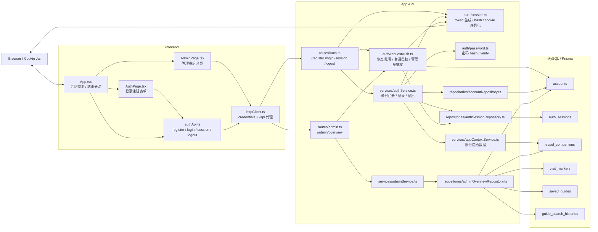
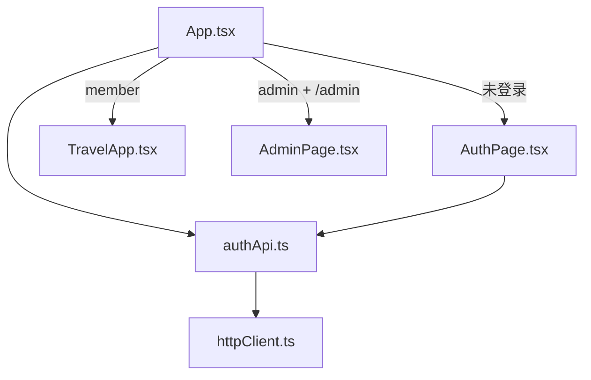
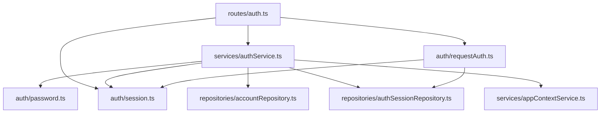
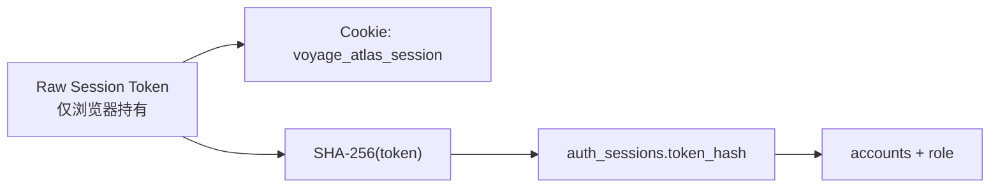
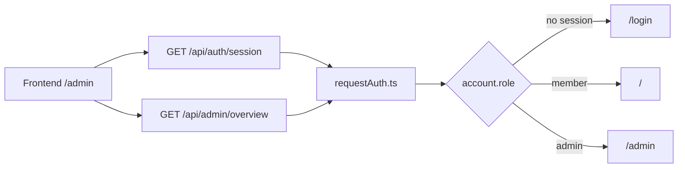
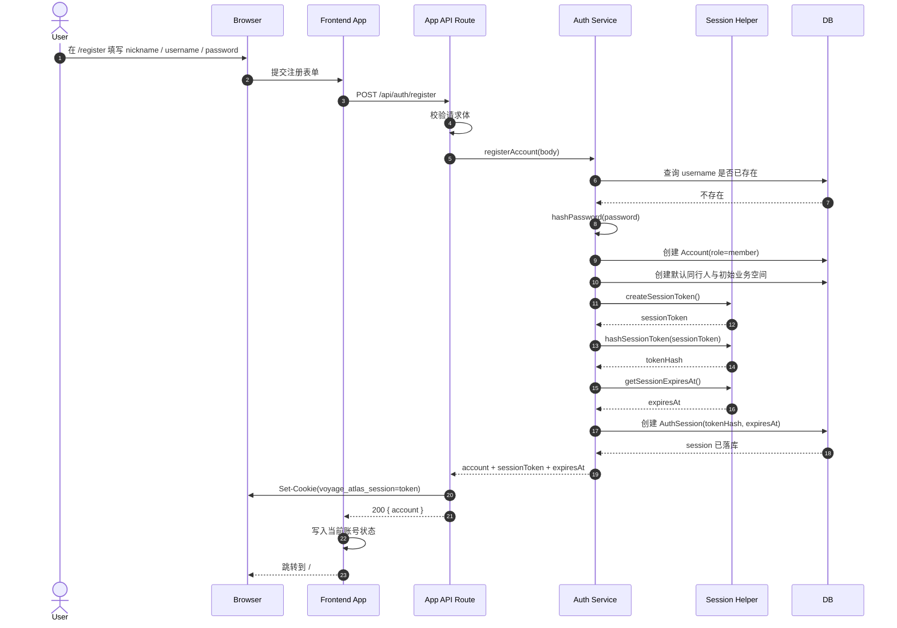
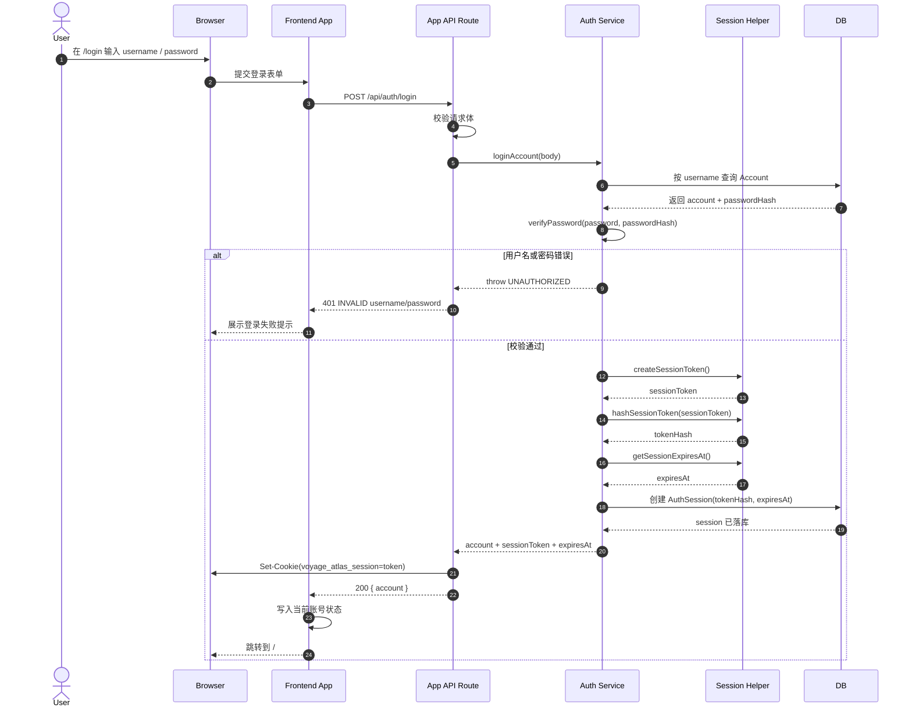
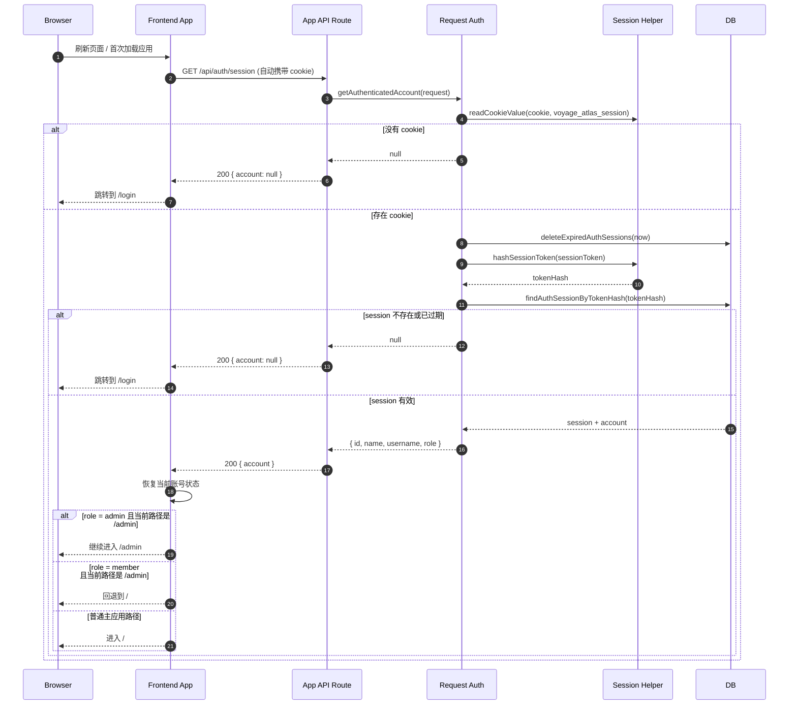
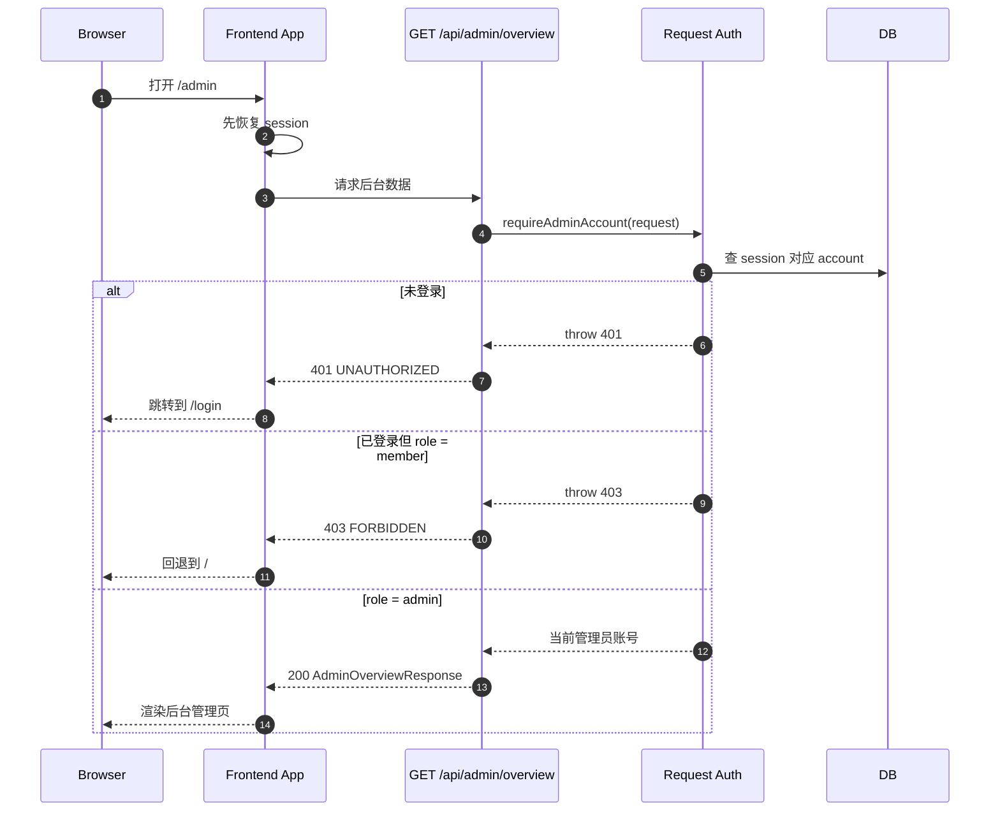

# 登录注册 + 会话 + 管理员权限技术方案

## 目标

本文档沉淀当前项目认证主线的正式技术方案，覆盖以下范围：

- 登录与注册能力
- Cookie Session 会话机制
- 会话恢复与退出登录
- 管理员角色与后台访问控制
- 默认账号与默认同行人初始化策略
- 相关 API、数据模型、时序、错误边界与验收建议

若需要评审版图示，请直接参考本文档末尾的两个附录：

- [附录 A：架构图 / Architecture Diagrams](#附录-a架构图--architecture-diagrams)
- [附录 B：时序图 / Sequence Diagrams](#附录-b时序图--sequence-diagrams)

适用对象：

- 前端开发
- `app-api` 后端开发
- 联调与测试同学
- 后续需要接手该模块的协作者

## 设计目标

- 路由语义清晰：登录使用 `/login`，注册使用 `/register`
- 会话恢复稳定：刷新页面后尽可能自动恢复当前账号
- 数据边界明确：不同账号拥有独立数据空间
- 权限判断统一：普通登录态与管理员权限由后端统一裁决
- 本地联调简单：默认账号、默认会话链路和本地启动方式清晰可复现
- 安全实现可接受：不在数据库存储明文密码，不在数据库存储明文 session token

## 非目标

- 不引入第三方 OAuth 登录
- 不支持多因素认证
- 不支持短信验证码、邮箱验证码
- 不支持 refresh token / access token 双令牌体系
- 不支持复杂 RBAC，仅支持 `admin` / `member` 两种角色

## 整体架构

认证链路由前后端共同完成：

- 前端路由与页面：
  - [App](file:///Users/bytedance/project/personal_travel_daily/src/modules/App.tsx)
  - [AuthPage](file:///Users/bytedance/project/personal_travel_daily/src/modules/auth/AuthPage.tsx)
- 前端 API 调用：
  - [authApi](file:///Users/bytedance/project/personal_travel_daily/src/lib/api/authApi.ts)
  - [httpClient](file:///Users/bytedance/project/personal_travel_daily/src/lib/api/httpClient.ts)
- 后端路由：
  - [auth.ts](file:///Users/bytedance/project/personal_travel_daily/server/appApi/routes/auth.ts)
- 后端服务：
  - [authService](file:///Users/bytedance/project/personal_travel_daily/server/appApi/services/authService.ts)
  - [requestAuth](file:///Users/bytedance/project/personal_travel_daily/server/appApi/auth/requestAuth.ts)
  - [session](file:///Users/bytedance/project/personal_travel_daily/server/appApi/auth/session.ts)
- 数据访问：
  - [accountRepository](file:///Users/bytedance/project/personal_travel_daily/server/appApi/repositories/accountRepository.ts)
  - [authSessionRepository](file:///Users/bytedance/project/personal_travel_daily/server/appApi/repositories/authSessionRepository.ts)
- 数据模型：
  - [schema.prisma](file:///Users/bytedance/project/personal_travel_daily/server/prisma/schema.prisma)

## 核心概念

### 账号

- 登录主体是真实账号 `Account`
- 一个 `Account` 对应一个独立数据空间
- 一个 `Account` 可以拥有多个同行人 `TravelCompanion`
- 一个 `Account` 拥有角色字段 `role`

### 会话

- 当前项目使用 Cookie Session，而不是 JWT
- 浏览器保存原始 session token
- 服务端数据库只保存 token 的 SHA-256 hash
- 每次请求由服务端通过 cookie 恢复账号身份

### 管理员

- 当前角色只有两种：
  - `admin`
  - `member`
- `admin` 可访问后台接口 `GET /api/admin/overview`
- `member` 登录后可以使用主应用，但无后台权限

## 路由与页面行为

### 前端路由

- `/login`
  - 登录页
  - 未登录默认落这里
- `/register`
  - 注册页
- `/auth`
  - 兼容性旧入口
  - 会被规范到 `/login`
- `/`
  - 已登录普通主应用
- `/admin`
  - 管理员后台页

对应实现见：

- [App](file:///Users/bytedance/project/personal_travel_daily/src/modules/App.tsx)
- [AuthPage](file:///Users/bytedance/project/personal_travel_daily/src/modules/auth/AuthPage.tsx)
- [AdminPage](file:///Users/bytedance/project/personal_travel_daily/src/modules/admin/AdminPage.tsx)

### 页面访问规则

- 未登录访问受保护页面：
  - 跳转到 `/login`
- 已登录访问 `/login` 或 `/register`：
  - 进入主页面 `/`
- 已登录 `member` 访问 `/admin`：
  - 前端回退到 `/`
  - 后端接口仍返回 `403 FORBIDDEN`
- 已登录 `admin` 访问 `/admin`：
  - 允许进入后台页

## 数据模型

### `Account`

定义见 [schema.prisma:L26-L41](file:///Users/bytedance/project/personal_travel_daily/server/prisma/schema.prisma#L26-L41)

关键字段：

- `id`
- `name`
- `username`
- `role`
- `passwordHash`

职责：

- 表示真实登录账号
- 提供会话归属
- 为业务数据提供账户级隔离

### `AuthSession`

定义见 [schema.prisma:L43-L55](file:///Users/bytedance/project/personal_travel_daily/server/prisma/schema.prisma#L43-L55)

关键字段：

- `id`
- `accountId`
- `tokenHash`
- `expiresAt`

职责：

- 保存服务端可识别的登录会话
- 不存储明文 token，只存 hash
- 支撑跨刷新会话恢复

### `AccountRole`

定义见 [schema.prisma:L21-L24](file:///Users/bytedance/project/personal_travel_daily/server/prisma/schema.prisma#L21-L24)

当前值：

- `admin`
- `member`

说明：

- `member` 为默认值
- 默认种子账号会被写成 `admin`

## 默认数据初始化策略

### 默认账号

本地执行 `npm run db:seed` 后会创建或更新默认账号。

相关实现：

- [seed.ts](file:///Users/bytedance/project/personal_travel_daily/server/prisma/seed.ts)
- [env.ts](file:///Users/bytedance/project/personal_travel_daily/server/appApi/env.ts)

默认配置：

- 账号 ID：`APP_DEFAULT_ACCOUNT_ID`
- 昵称：`APP_DEFAULT_ACCOUNT_NAME`
- 用户名：`APP_DEFAULT_ACCOUNT_USERNAME`
- 密码：`APP_DEFAULT_ACCOUNT_PASSWORD`

当前约定：

- 默认账号角色固定为 `admin`

### 默认同行人

相关实现：

- [defaultCompanions.ts](file:///Users/bytedance/project/personal_travel_daily/server/appApi/defaultCompanions.ts)
- [appContextService.ts](file:///Users/bytedance/project/personal_travel_daily/server/appApi/services/appContextService.ts)

当前策略：

- 默认种子账号：
  - 使用项目预设默认同行人模板
- 新注册账号：
  - 只初始化 `1` 个默认同行人
  - 该同行人名称直接使用注册时填写的昵称

这样做的原因：

- 默认演示账号需要更完整的演示数据
- 新注册账号需要尽量轻量，避免强行灌入多位同行人

## API 设计

完整契约见 [app-api-contract.md](file:///Users/bytedance/project/personal_travel_daily/docs/technical/app-api-contract.md)。

### `POST /api/auth/register`

职责：

- 创建新账号
- 初始化账号默认数据
- 立即创建 session
- 通过 `Set-Cookie` 让用户注册后自动登录

请求体：

```json
{
  "nickname": "小明的旅行档案",
  "username": "xiaoming",
  "password": "demo123456"
}
```

成功响应：

```json
{
  "account": {
    "id": "acct_xxx",
    "name": "小明的旅行档案",
    "username": "xiaoming",
    "role": "member"
  }
}
```

失败场景：

- `409 CONFLICT`
  - 用户名已存在
- `400 INVALID_REQUEST`
  - 参数不合法

### `POST /api/auth/login`

职责：

- 校验用户名密码
- 创建新 session
- 通过 `Set-Cookie` 写入浏览器

请求体：

```json
{
  "username": "demo",
  "password": "demo123456"
}
```

失败场景：

- `401 UNAUTHORIZED`
  - 用户名不存在或密码错误

### `GET /api/auth/session`

职责：

- 恢复当前登录账号
- 为前端启动时判断登录态提供统一入口

成功响应：

```json
{
  "account": {
    "id": "acct_default",
    "name": "Voyage Atlas",
    "username": "demo",
    "role": "admin"
  }
}
```

未登录响应：

```json
{
  "account": null
}
```

### `POST /api/auth/logout`

职责：

- 删除当前 token 对应的 session
- 通过过期 cookie 清掉浏览器侧会话

成功响应：

```json
{
  "success": true
}
```

### `GET /api/admin/overview`

职责：

- 返回管理员后台聚合视图

权限：

- 需要登录
- 需要 `role = admin`

失败场景：

- `401 UNAUTHORIZED`
- `403 FORBIDDEN`

## Session 技术方案

### 选择 Cookie Session 的原因

- 当前项目同源开发体验更简单
- 前端不需要管理 token 存储与刷新
- 浏览器自动带 cookie，适合当前应用规模
- 服务端可主动失效会话，便于管理员权限和登出控制

### Session 生成过程

实现见：

- [authService.ts](file:///Users/bytedance/project/personal_travel_daily/server/appApi/services/authService.ts)
- [session.ts](file:///Users/bytedance/project/personal_travel_daily/server/appApi/auth/session.ts)
- [authSessionRepository.ts](file:///Users/bytedance/project/personal_travel_daily/server/appApi/repositories/authSessionRepository.ts)

过程：

1. 注册或登录成功
2. 调用 `createSessionToken()`
3. 生成 32 字节随机 token
4. 调用 `hashSessionToken()` 生成 SHA-256 hash
5. 将 `tokenHash + accountId + expiresAt` 落库到 `auth_sessions`
6. 将原始 token 通过 `Set-Cookie` 写回浏览器

### Cookie 规则

定义见 [session.ts:L3-L24](file:///Users/bytedance/project/personal_travel_daily/server/appApi/auth/session.ts#L3-L24)

当前配置：

- 名称：`voyage_atlas_session`
- `HttpOnly`
- `SameSite=Lax`
- `Path=/`
- 有显式 `Expires`

说明：

- `HttpOnly` 避免前端 JS 直接读取 cookie
- `SameSite=Lax` 兼顾基础安全性与当前同源开发体验

### 为什么数据库只存 `tokenHash`

- 即使数据库被直接查看，也无法拿到浏览器里的原始 token
- 服务端认证时只需把 cookie token 做同样 hash，再按 hash 查库
- 这是当前项目体量下足够合理的安全折中

### Session 恢复过程

实现见 [requestAuth.ts](file:///Users/bytedance/project/personal_travel_daily/server/appApi/auth/requestAuth.ts)

过程：

1. 请求到达后读取 cookie
2. 取出 `voyage_atlas_session`
3. 调用 `hashSessionToken()`
4. 查询 `auth_sessions`
5. 清理已过期 session
6. 若命中且未过期，返回当前账号信息
7. 若未命中或已过期，视为未登录

### Session 失效过程

- 显式登出：
  - `POST /api/auth/logout`
  - 删除数据库 session
  - 返回过期 cookie
- 被动失效：
  - `expiresAt` 到期
  - 下次请求时清理过期 session 并返回未登录

## 注册流程时序

### 注册

1. 前端在 `/register` 提交 `nickname / username / password`
2. 路由层 [auth.ts](file:///Users/bytedance/project/personal_travel_daily/server/appApi/routes/auth.ts) 校验请求体
3. 服务层 [registerAccount](file:///Users/bytedance/project/personal_travel_daily/server/appApi/services/authService.ts#L24-L64) 开启事务
4. 校验用户名是否已存在
5. 对密码做 hash
6. 创建 `Account`
7. 创建默认同行人与初始业务空间
8. 创建 `AuthSession`
9. 返回账号 DTO + session token
10. 路由层写 `Set-Cookie`
11. 前端拿到账号信息并进入已登录态

### 登录

1. 前端在 `/login` 提交用户名和密码
2. 路由层校验请求体
3. 服务层 [loginAccount](file:///Users/bytedance/project/personal_travel_daily/server/appApi/services/authService.ts#L67-L91) 查询账号
4. 校验密码 hash
5. 创建新的 `AuthSession`
6. 路由层写 `Set-Cookie`
7. 前端进入主页面

### 刷新恢复登录

1. 前端启动时先请求 `GET /api/auth/session`
2. 浏览器自动带上 cookie
3. 服务端按 token hash 查 `auth_sessions`
4. 命中后返回账号 DTO
5. 前端根据账号与角色决定进入 `/` 或 `/admin`

## 前端实现分层

### 页面与路由

- [App](file:///Users/bytedance/project/personal_travel_daily/src/modules/App.tsx)
  - 会话恢复
  - 路由分流
  - 根据角色决定是否进入后台页
- [AuthPage](file:///Users/bytedance/project/personal_travel_daily/src/modules/auth/AuthPage.tsx)
  - 登录表单 / 注册表单
  - 登录注册切换

### API 层

- [authApi](file:///Users/bytedance/project/personal_travel_daily/src/lib/api/authApi.ts)
  - `register`
  - `login`
  - `fetchSession`
  - `logout`

### 请求层

- [httpClient](file:///Users/bytedance/project/personal_travel_daily/src/lib/api/httpClient.ts)
  - 默认携带 `credentials`
  - 本地开发优先走同源 `/api`

## 后端实现分层

### 路由层

- [auth.ts](file:///Users/bytedance/project/personal_travel_daily/server/appApi/routes/auth.ts)
  - 参数校验
  - 调用 service
  - 写 cookie

### 服务层

- [authService](file:///Users/bytedance/project/personal_travel_daily/server/appApi/services/authService.ts)
  - 注册与登录主业务逻辑
  - 账号 DTO 序列化

### 鉴权层

- [requestAuth](file:///Users/bytedance/project/personal_travel_daily/server/appApi/auth/requestAuth.ts)
  - 恢复当前账号
  - 普通鉴权
  - 管理员鉴权

### 仓储层

- [accountRepository](file:///Users/bytedance/project/personal_travel_daily/server/appApi/repositories/accountRepository.ts)
- [authSessionRepository](file:///Users/bytedance/project/personal_travel_daily/server/appApi/repositories/authSessionRepository.ts)

## 管理员权限方案

### 权限真值

- 账号角色保存在 `Account.role`
- 当前不依赖用户名白名单
- 当前不依赖前端本地状态进行权限裁决

### 权限判断入口

实现见 [requestAuth.ts:L37-L53](file:///Users/bytedance/project/personal_travel_daily/server/appApi/auth/requestAuth.ts#L37-L53)

- `requireAuthenticatedAccount()`
  - 需要登录
- `requireAdminAccount()`
  - 需要登录且 `role === 'admin'`

### 默认管理员产生方式

- 默认种子账号在 [seed.ts](file:///Users/bytedance/project/personal_travel_daily/server/prisma/seed.ts) 中被写为 `admin`
- 普通注册用户默认写为 `member`

### 前后端权限分工

- 后端：
  - 负责最终权限裁决
  - 防止前端绕过
- 前端：
  - 负责路由体验和友好跳转
  - 例如普通用户访问 `/admin` 时回退到 `/`

## 安全与边界

### 密码

- 密码不会明文入库
- 实际 hash 逻辑位于 [password.ts](file:///Users/bytedance/project/personal_travel_daily/server/appApi/auth/password.ts)

### Session

- 浏览器持有原 token
- 数据库存 `tokenHash`
- 登出会删库并清 cookie

### 最小权限

- 普通用户无法访问后台管理接口
- 普通用户只能在自己的账户空间下写数据

### 当前仍可继续加强的点

- 生产环境可考虑补充 `Secure` cookie
- 可补登录失败频率限制
- 可补审计日志
- 可补更细的管理员操作记录

## 错误处理策略

通用错误定义见 [errors.ts](file:///Users/bytedance/project/personal_travel_daily/server/appApi/errors.ts)

认证相关重点错误：

- `400 INVALID_REQUEST`
  - 请求体不合法
- `401 UNAUTHORIZED`
  - 未登录
  - 或登录凭据错误
- `403 FORBIDDEN`
  - 已登录但无管理员权限
- `409 CONFLICT`
  - 用户名重复
- `503 DATABASE_UNAVAILABLE`
  - 数据库未就绪

## 联调与验收

### 本地联调前置

```bash
npm run db:generate
npm run db:migrate:deploy
npm run db:seed
npm run dev:app-api
npm run dev
```

### 推荐验收清单

1. 未登录进入应用，默认进入 `/login`
2. 访问 `/register` 可以成功注册新账号
3. 新注册账号默认只创建 1 个同行人，且名称为注册昵称
4. 登录成功后写入 cookie，并自动进入主页面
5. 刷新页面后仍可通过 `GET /api/auth/session` 恢复登录
6. `/auth` 能自动跳转到 `/login`
7. 退出登录后 cookie 被清除，页面回到 `/login`
8. 默认种子账号 `demo` 角色为 `admin`
9. 普通用户访问 `/api/admin/overview` 返回 `403`
10. 管理员访问 `/api/admin/overview` 返回 `200`

### 推荐验证命令

```bash
npm run test -- --run server/__tests__/authService.spec.ts server/__tests__/appApiRoutes.spec.ts src/modules/__tests__/App.spec.tsx
npm run build
```

## 与现有文档的关系

- [登录注册说明](./auth-login-register.md)
  - 面向快速上手与联调
- [App API Contract](./app-api-contract.md)
  - 面向接口契约
- 本文档：
  - 面向完整技术设计与实现收口（含架构图与时序图附录）

## 后续演进建议

- 增加登录失败限流
- 增加账号管理与管理员操作审计
- 根据部署环境补充 `Secure` cookie 策略
- 若后续出现外部系统接入，再评估 OAuth / SSO

## 附录 A：架构图 / Architecture Diagrams

本附录用于评审“认证模块整体结构”，重点回答下面几个问题：

- 前端认证相关模块分别负责什么
- 后端路由、服务、会话、仓储如何分层
- 会话 token、Cookie、数据库 session 之间如何流转
- 管理员权限判断落在哪一层

This appendix answers: frontend module responsibilities, backend layering, token/cookie/session flow, and admin-permission placement.

### A.1 认证模块总览 / Module Overview



评审重点：

- 前端不直接管理 session token 逻辑，而是通过 `authApi + httpClient` 与后端交互
- 后端把认证职责拆成路由层、服务层、会话工具层、鉴权恢复层、仓储层
- 管理员权限不在前端判断真值，而在 `requestAuth.ts`

### A.2 前端认证模块分层 / Frontend Layering



### A.3 后端认证模块分层 / Backend Layering



### A.4 Session 存储与恢复结构 / Session Storage and Restore



关键原则：浏览器持有原始 token，数据库仅存 `token_hash`，服务端恢复登录时读 cookie → hash → 查库 → 关联 account。

### A.5 管理员权限落点 / Admin Permission



权限设计结论：前端负责“怎么跳”，后端负责“能不能进”。

## 附录 B：时序图 / Sequence Diagrams

本附录聚焦“登录注册 + 会话管理”的关键时序，不展开所有实现细节。

This appendix focuses on the key sequences of register / login / session restore / logout / admin access.

### B.0 参与方 / Participants

- `Browser`：浏览器与用户交互界面
- `Frontend App`：前端 React 应用
- `App API Route`：`server/appApi/routes/auth.ts`
- `Auth Service`：`server/appApi/services/authService.ts`
- `Session Helper`：`server/appApi/auth/session.ts`
- `DB`：MySQL + Prisma（`accounts` / `auth_sessions`）

### B.1 注册并自动登录 / Register + Auto Login



### B.2 登录并创建新会话 / Login + New Session



### B.3 刷新页面后的会话恢复 / Session Restore on Refresh



### B.4 退出登录 / Logout

```mermaid
sequenceDiagram
    autonumber
    actor User
    participant Browser
    participant Frontend as Frontend App
    participant Route as App API Route
    participant Service as Auth Service
    participant Session as Session Helper
    participant DB

    User->>Browser: 点击退出登录并确认
    Browser->>Frontend: 触发 logout
    Frontend->>Route: POST /api/auth/logout (自动携带 cookie)
    Route->>Session: readCookieValue(cookie, voyage_atlas_session)
    Session-->>Route: sessionToken
    Route->>Service: logoutAccount(sessionToken)
    Service->>Session: hashSessionToken(sessionToken)
    Session-->>Service: tokenHash
    Service->>DB: deleteAuthSessionByTokenHash(tokenHash)
    DB-->>Service: 删除成功
    Service-->>Route: ok
    Route->>Browser: Set-Cookie(voyage_atlas_session=; Expires=过去时间)
    Route-->>Frontend: 200 { success: true }
    Frontend->>Frontend: 清空当前账号状态
    Frontend-->>Browser: 跳转到 /login
```

### B.5 管理员访问后台 / Admin Backoffice Access



评审重点：管理员权限依赖 `Account.role`；前端体验做“回退主页”，真正的权限裁决必须由后端完成。
